# EasyTalk - Real-time Chat Application (Diploma Thesis)

</table>
<table>
<tr><td width="200">

</td><td>

# EasyTalk

#### EasyTalk is a modern, feature-rich web-based chat application built with PHP, WebSockets, and MySQL. It offers real-time messaging, file sharing, voice and video recording, image capturing, and comprehensive user management.

</td></tr>
</table>

## Description

This web application implements a real-time communication platform for asynchronous messaging between users, developed as part of a Diploma Thesis for the **Department of Electrical & Computer Engineering** at the University of Western Macedonia in 2025.

EasyTalk is a comprehensive chat system that provides secure real-time messaging with multimedia support, including text, images, audio, video, and document sharing. The application features WebSocket-based instant messaging, user authentication with "remember me" functionality, file upload capabilities, and message management including deletion features.

The system is built using modern web technologies with PHP backend, MySQL database, and WebSocket server for real-time communication, making it resistant to common web vulnerabilities while providing a smooth user experience for instant messaging and file sharing.

## Features

### Core Messaging

- **Real-time Chat**: Instant messaging using WebSocket technology
- **Message Encryption**: Secure message transmission with encryption support
- **Message Status**: Read receipts and delivery confirmations
- **Message Deletion**: Users can delete their own messages

### File Sharing

- **Multi-format Support**: Images, audio, video, documents (PDF, Word, Excel, PowerPoint), and text files
- **File Upload**: Drag-and-drop file upload with size validation
- **Media Preview**: In-chat preview for images, audio, and video files
- **Document Icons**: Visual indicators for different document types

### Communication Features

- **Photo Capture**: Take and share photos directly from the chat
- **Audio Recording**: Record and send voice messages
- **Video Recording**: Record and send video messages
- **Email Notifications**: Automatic email alerts for offline users when they receive new messages, with user-configurable preferences in settings

### User Management

- **User Registration**: Secure signup with email verification
- **Profile Management**: Customizable user profiles with profile pictures
- **Friend System**: Add and manage friends
- **Online Status**: Real-time user presence indicators
- **User Search**: Find and connect with other users

### Security & Privacy

- **Input Sanitization**: Comprehensive input validation and sanitization
- **SQL Injection Prevention**: Prepared statements for database queries
- **Password Hashing**: Strong password hashing using PHP's password_hash() function
- **Email Verification**: Account verification via email
- **Session Security**: Secure session management with "Remember Me" functionality
- **JWT Authentication**: Secure token-based authentication with configurable expiration
- **Secure File Handling**: Safe file upload and download mechanisms with MIME type checking
- **File Access Control**: Protected file downloads through controlled PHP handlers
- **Privacy Controls**: Users can hide their usernames from search results - only users who know the exact username can find and connect with them
- **CSRF Protection**: Cross-site request forgery protection
- **XSS Protection**: Output escaping and content security policies


## Demo Screenshots

### Login Page
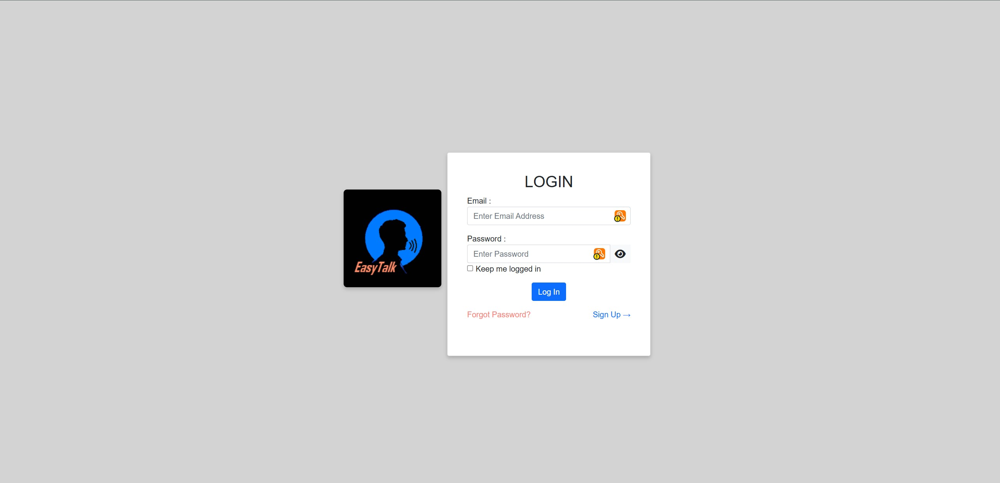
*Secure user authentication with "Remember Me" functionality and clean, modern interface*

### User Registration
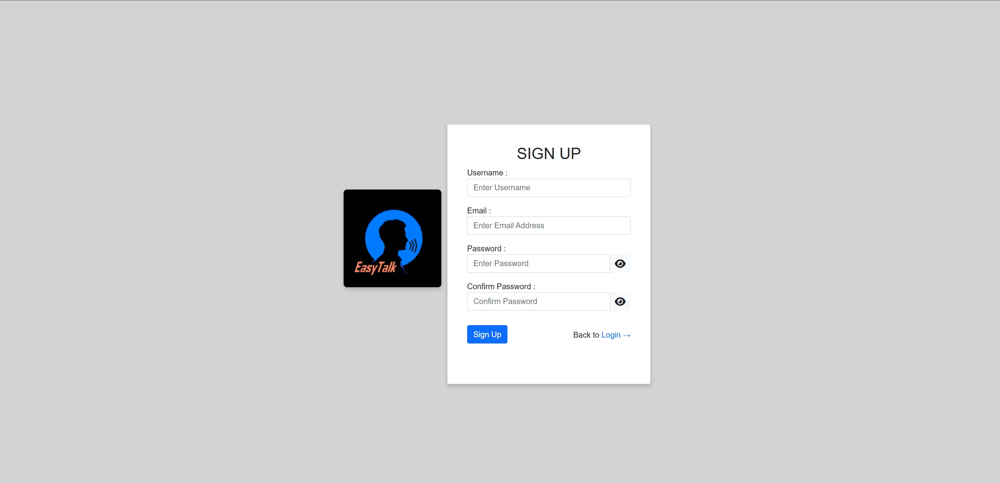
*Easy registration process with email verification and password confirmation*

### Home Dashboard
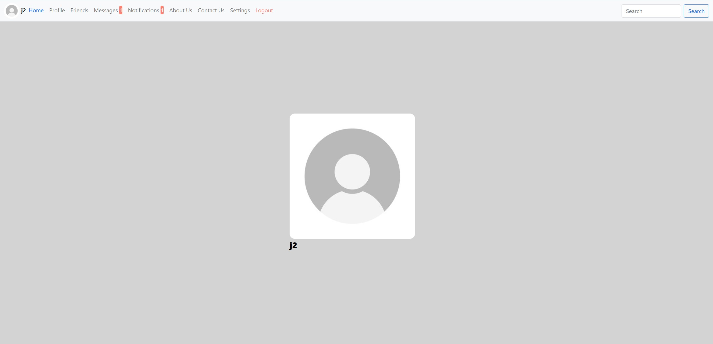
*Personalized home page displaying user profile and quick navigation*

### Profile Management
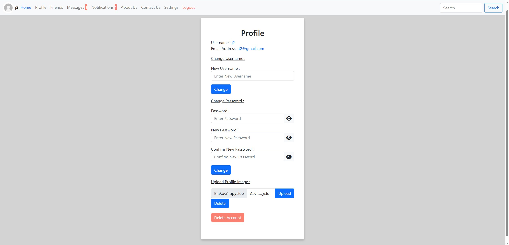
*Comprehensive profile customization with profile picture upload and personal information*

### Friend List
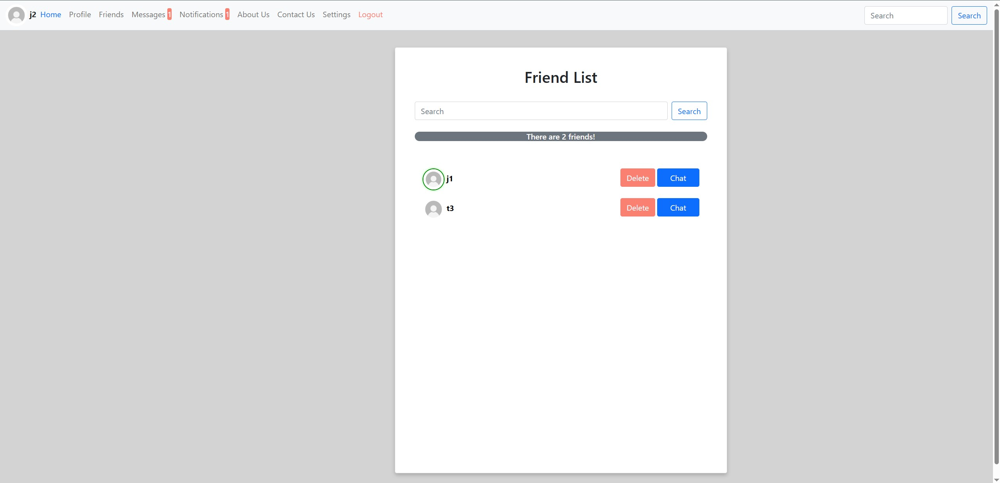
*Manage your connections with real-time online status indicators and friend management options*

### Messages Overview
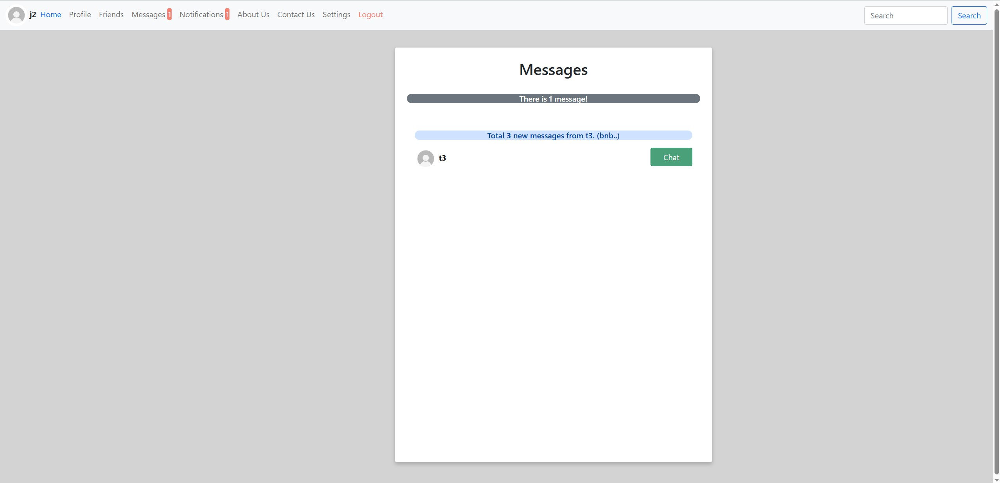
*View all unread messages with sender information and message previews*

### Notifications Center
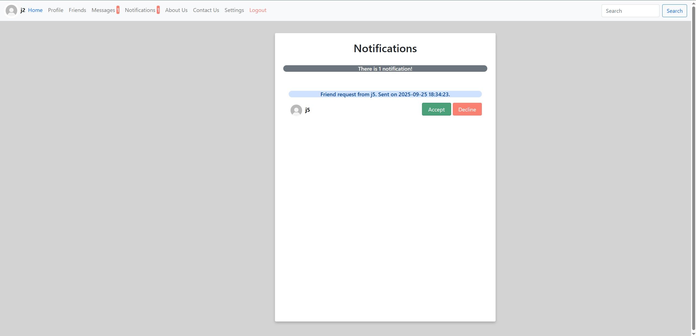
*Handle friend requests with Accept/Decline options and view all pending notifications*

### About Us
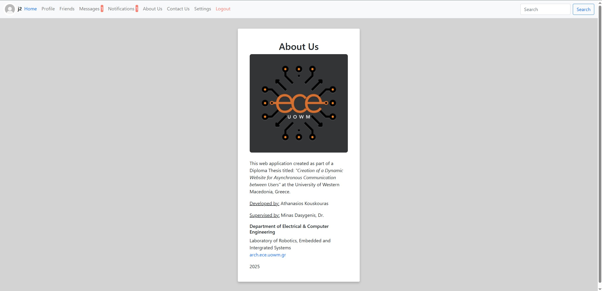
*Learn about the EasyTalk project*

### Contact Support
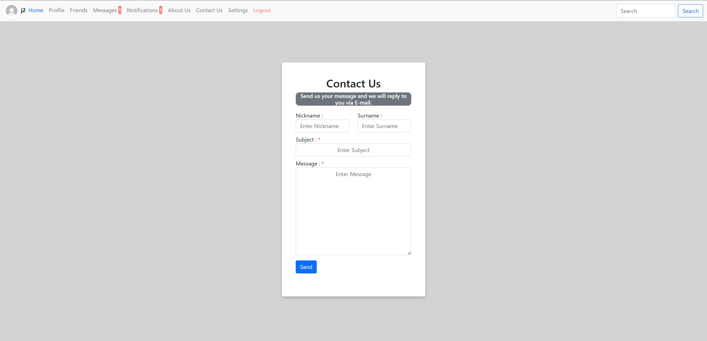
*Easy-to-use contact form for user support and feedback submission*

### Settings & Privacy
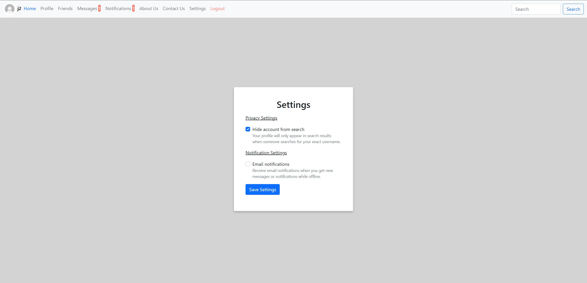
*Comprehensive privacy controls including account visibility and email notification preferences*

### User Search
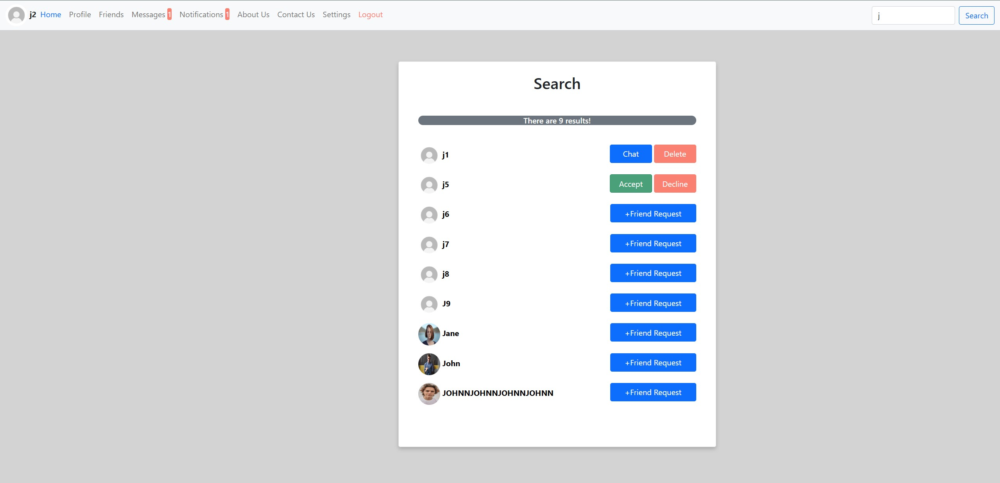
*Advanced user search functionality with multiple result management options (Chat, Friend Request, Accept/Decline)*

### Chat Interface
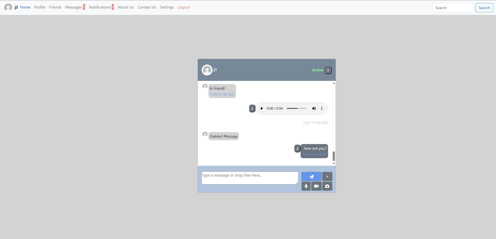
*Real-time messaging with multimedia support, audio messages, message deletion, and intuitive chat controls*


---

## Technology Stack

- **Backend**: PHP 8.2.0
- **Database**: MySQL 8.0.32 - MySQL Community Server - GPL
- **Real-time Communication**: Ratchet WebSocket Server
- **Frontend**: HTML5, CSS3, JavaScript, Bootstrap
- **File Handling**: Custom file upload system with MIME type validation
- **Email**: SMTP email integration for notifications

## Requirements

- **PHP 8.0+** with extensions: `mysqli`, `pdo_mysql`, `json`, `mbstring`, `openssl`, `curl`, `gd`
- **MySQL 5.7+** or **MariaDB 10.3+**
- **Composer** (PHP dependency manager)
- **Web Server** (Apache, Nginx, or PHP built-in server for development)

## Installation

1. **Clone the repository**
   ```bash
   git clone https://github.com/thanasis-kouskouras/Real-time-Chat-Application.git
   
2. **Install dependencies**
   ```bash
   composer install
   
3. **Database Setup**
   - Create a MySQL database
     ```bash
     mysql -u root -p -e "CREATE DATABASE your_database;"
   
   - Import the database schema
     ```bash
     mysql -u username -p your_database < database.sql

4. **Configuration**
   
   - Database Configuration: <br>
   
     Edit `includes/dbh.inc.php` and update the database connection settings:
     
     ```php
     <?php
     $servername = "localhost";
     $username = "your_server_username"; // Your MySQL username
     $password = "your_secure_password"; // Your MySQL password
     $dbname = "your_database_name";     // Your database name

   - Application Settings: <br>
   
     Edit `config.php` and configure the following:

     1. Base URL Configuration (adjust to your setup): <br>
        ```php
        $urlServer = "http://localhost/Real-time-Chat-Application/"; //Change if deployed elsewhere

     2. Timezone (change to your location): <br>
        ```php
        date_default_timezone_set('Europe/Athens');

     3. File Upload Settings: <br>
        ```php
        const MAX_FILE_SIZE = 50 * 1024 * 1024; //50MB max file size

     4. JWT Security (change these in production): <br>
        ```php
        const JWT_SECRET = "your-super-secret-key-here"; 
        const JWT_ISSUER = "your_issuer_here";
        const JWT_AUD = "your_audience_here";

    - Email Configuration: <br>
    
      For email verification and notifications, configure SMTP settings:

      1. Set email method in `config.php`:
         
         ```php
         const USE_MAIL = "PhpMailer"; // or "Native"

      2. Update SMTP settings in `includes/functions.inc.php` (look for sendMailWithPhpMailer() function):
     
         ```php
         // SMTP Configuration
         $mail->isSMTP();
         $mail->Host = 'smtp.gmail.com';            // Your SMTP server
         $mail->SMTPAuth = true;                    
         $mail->Username = 'your-email@gmail.com';  // Your email
         $mail->Password = 'your-app-password';     // Your email password/app password
         $mail->SMTPSecure = PHPMailer::ENCRYPTION_STARTTLS;
         $mail->Port = 587;

      3. Update the rest email functions in `includes/functions.inc.php` with your email
     
      4. If you are using XAMPP in `xampp/sendmail/sendmail.ini` change:
         ```php
         auth_username = your-email@gmail.com
         auth_password = your-app-password

6. **Start Web Server** <br>

   For example if you are using XAMPP, start the Apache Server.
   
7. **Start WebSocket Server**
   ```bash
   php .\bin\chat-server.php

8. **Access the application**
   
   1. Open your web browser
   2. Navigate to your configured URL (e.g. http://localhost/Real-time-Chat-Application/ or http://localhost:8000)
   3. Register a new account and start chatting!
   
## Academic Context

**Diploma Thesis**: Creation of a Dynamic Website for Asynchronous Communication between Users  
**Institution**: University of Western Macedonia  
**Department**: Electrical & Computer Engineering  
**Laboratory**: [Robotics, Embedded and Integrated Systems](https://arch.ece.uowm.gr/)  
**Year**: 2025  
**Developer**: Athanasios Kouskouras  
**Supervisor**: Dr. Minas Dasygenis 

## Contributing

This project was developed as a Diploma Thesis and is open source for educational and personal use. We welcome contributions from developers who want to help improve EasyTalk! Whether you're fixing bugs, adding new features, improving documentation, or enhancing security, your contributions are valuable to the community.

All contributors will be acknowledged. Significant contributions will be highlighted in project documentation.

## License

This project is dual-licensed: 

- **Open Source:** GNU AGPLv3
- **Commercial License:** Available upon request. Contact: tnskousko@gmail.com

See the [LICENSE](LICENSE) file for details.


